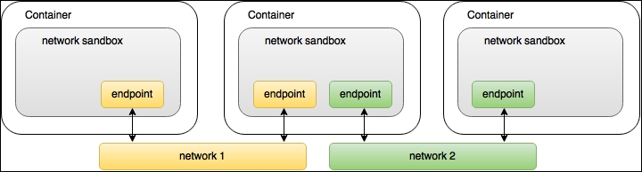
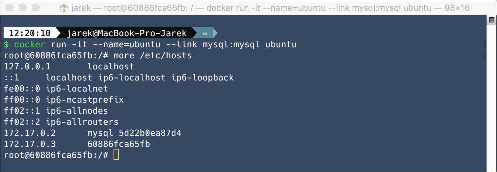
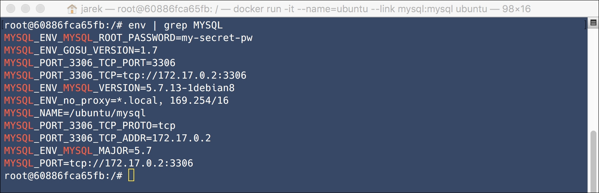

# Benefits of using Docker

## Speed and size

## Reproducible and portable builds

## Immutable and agile infrastructure

## Docker Engine and Docker Engine client

Docker is a client-server application. It consists of the daemon that does the important job: builds and downloads images, starts and stops containers and so on. It exposes a REST API that specifies interfaces for interacting with the daemon and is being used for remote management. Docker Engine accepts Docker commands from the command line, such as docker to run the image, docker ps to list running containers, docker images to list images, and so on.

The Docker client is a command-line program that is used to manage Docker hosts running Linux containers. It communicates with the Docker server using the REST API wrapper. You will interact with Docker by using the client to send commands to the server.

Docker Engine works only on Linux. If you want run Docker on Windows or Mac OS, or want to provision multiple Docker hosts on a network or in the cloud, you will need **Docker Machine**.

## Docker Machine

It's a quick way to get a new virtual machine provisioned and ready to run Docker containers. Docker Machine not only creates a new VM with the Docker Engine installed in it, but sets up the certificate files for authentication and then configures the Docker client to talk to it. In fact, when you install Docker for Windows or Mac OS, the default VirtualBox driver will be used. The following command will be executed behind the scenes:

```bash
docker-machine create --driver=virtualbox default
```
Another available driver is amazonec2 for Amazon Web Services. It can be used to install Docker on the Amazon's cloud

The list contains the following drivers at the moment:

Amazon Web Services
Microsoft Azure
Digital Ocean
Exoscale
Google Compute Engine
Generic
Microsoft Hyper-V
OpenStack
Rackspace
IBM Softlayer
Oracle VirtualBox
VMware vCloud Air
VMware Fusion
VMware vSphere

 If you want to deal with the cloud providers or just want to have common runtime environment portable between Mac OS, Windows, and Linux, you can install Docker Machine for Linux as well. 

 # Chapter 3. Understanding Images and Containers

 ## Layers
 Each image consists of a series of layers that are stacked on one another. 
 
To maintain the order of layers, Docker utilizes the concept of layer IDs and pointers. Each layer contains the ID and a pointer to its parent layer. A layer without a pointer referencing the parent is the first layer in the stack, a base. You can see the relation in the following diagram:
 

 Another advantage of using layers is the persistence of history. Layers can provide a history of how a specific image was built. Once all the layers are finished downloading, you can list the layers in the specific image using the history command:

 ```
docker history ubuntu
 ```

 You can also see the graphical representation of the image using the ImageLayers web application available at https://imagelayers.iron.io

 If you create a large file in the container, make a commit (we will get to that in a while), then delete the file, and do another commit, this file will still be present in the layer history. 
 
 To flatten the image, you can export it to a TAR file, using the export command:
 ```
docker export <CONTAINER ID> >
   /home/docker/myImage.tar
 ```

 The exported file can then be imported back, using the import command:

 ```
$ 
cat /home/docker/myImage.tar | docker

   import - some-name:latest
 ```

If the free disk space is really an issue, you can pipe the output stream of export into the input stream of import:
```
$ docker export <CONTAINER ID> | docker
   import - exampleimagelocal:new
```

Alternatively, you can use the docker-squash utility, available at GitHub https://github.com/jwilder/docker-squash, to make your images smaller. It will squash multiple Docker layers into one in order to create an image with fewer and smaller layers.

As we have said before, Docker images are stored as series of read-only layers. This means that once the container image has been created, it does not change. But having all the filesystem read-only would not have a lot of sense. What about modifying an image? Adding your software to a base web server image? Well, when we start a container, Docker actually takes the read-only image (with all its read-only layers) and adds a read/write layer on top of the layer's stack. Let's focus on containers now.

## Containers

A running instance of an image is called a **container**. Docker launches them using the Docker images as read-only templates. To use a programming metaphor, if an image is a class, then a container is an instance of a class-a runtime object. Containers are lightweight and portable encapsulations of an environment in which to run applications. 

```
$
docker run -it ubuntu:latest
   /bin/bash
```

Sometimes we can tell Docker that we will not need a container after it is stopped. For this purpose, there is the -rm option available for the run command:
```
docker run -i -t -rm ubuntu:latest
   /bin/bash
```

To stop a container, use the docker stop command. The Docker stop has the following syntax:

```
docker stop [OPTIONS] <container
    ID/name> [<container ID/name...]

 docker stop fa19b25b311e

 docker stop $(docker ps -q)   -- stop all the containers which are running.

 docker ps -a
```

To remove a container, you can just use the rm command. If you want to remove all stopped containers at once, you can use the list of containers (given by the ps command) and a filter:
```
docker rm -v $(docker ps -q -f
    status=exited)
```
### Saving changes to a container

If you modify a file in the running container, the file will be copied out of the underlying read-only layer and into the top, read/write layer. Your changes will be applied only in the top layer, and the union filesystem will hide the underlying file. The original file will not be destroyed - it still exists in the underlying, read-only layer.If you delete the container, and relaunch the same image again, Docker will start a fresh container without any of the changes made in the previously running container.

In other words, your changes to the filesystem will not affect the base image. However, you can create a new image from a running container (and all its changes) using the commit command:

```
docker commit <container-id> 
    <image-name>
```

Creating images by altering the top writable layer in the container is useful when debugging and experimenting, but it's usually better to use Dockerfile to manage your images in a documented and maintainable way. 

## Docker registry, repository and index

You can tag an image, and store multiple versions of that image with different IDs in a single named repository, access different tagged versions of an image with a special syntax, such as username/image_name:tag. A Docker repository is identified by a URI and can either be public or private.

```
{registryAddress}/{namespace}/{repositoryName}:{tag}

docker pull ubuntu:14.04 
```

To run you own docker hub

```
docker run -d -p 5000:5000 --name
   registry registry:2
```

## Summary

We already know that the Dockerfile is the source code of the Image. It contains ordered instructions on how to build an image. An image is a specific state of a filesystem: a read-only, frozen immutable snapshot of a live container. It's composed of layers representing changes in the filesystem at various points in time; layers are a bit like the commit history of a Git repository. Containers, on the other hand are runtime instances of an image. They can have state (for example, running or stopped). You can make changes to the filesystem on a container and commit them to make them persisted, but only changes in the filesystem can be committed - memory changes will be lost. Commit always creates a new image. We also mentioned the concept of a registry, which holds a collection of named repositories, which themselves are a collection of images tracked by their IDs. A registry is like a Git repository: you can push and pull containers. 

# Chapter 4. Networking and Persistent Storage

## Docker networking
Docker uses the concept of the Container Network Model (CNM). 

There are three entities present in the CNM:

* sandbox: This is an isolated environment holding the networking configuration for a container.
* endpoint: This is a network interface that can be used for communication over a specific network. Endpoints join to exactly one network. Multiple endpoints can exist within a single network sandbox.
* network: It's a group of endpoints that are able to communicate with each other. You could create, for example, two separate networks, and they will be completely isolated. Network can be identified by their names (such as backend and frontend) or IDs (generated automatically by Docker during the network creation).



By default, two network drivers are provided by Docker: the bridge and the overlay driver. 

All containers on the same network can communicate with each other *freely*. An endpoint provides network connectivity for a sandbox - if you need to join a container to multiple networks, there should be multiple endpoints per container. 

### Default networks

We have three networks installed by default: host, none, and bridge.

### Host network

If you start your container with the --net=host option, then the container will use the host network. It's a network created by default and it is using the host driver. It's as fast as the normal networking: there is no bridge, no translation, nothing. That's why it can be useful when you need to get the best network performance. In this mode, container shares the networking namespace of the host (your local machine, for example), directly exposing it to the outside world. In the case of --net=host, the container can be accessed through the host's IP address. **This also means that you need not use port mapping to reach services inside the container**. However, you need to be aware that this can be dangerous. If you have an application running as root and it has vulnerabilities, there will be a risk of security breach - someone can get the remote control of the host network via the Docker container.

## Bridged network

It's also the default network in Docker. When the Docker service daemon starts, it configures a virtual bridge named docker0. Unless you specify a network with the docker run --net=<NETWORK> option, the Docker daemon will connect the container to the bridge network by default. Docker will find a free IP address from the range available on the bridge and will configure the container's eth0 interface with that IP address. From now on, if the new container wants to, for example, connect to the Internet, it will use the bridge - the host's own IP address will be used as the gateway. This bridge will automatically forward packets between any other network interfaces that are attached to it and also allow containers to communicate with the host machine as well as with the containers on the same host.

**By default, Docker containers can make connections to the outside world, they connect via the docker0 interface, but the outside world cannot connect to containers.**

The docker network inspect command that we saw earlier shows all the connected containers and their network resources on a given network. 

## Creating a network

```
$ docker network create backend
```

## Running a container in a network

```
docker run -it --net=bridge ubuntu

docker run -it --name=myUbuntu --net=bridge ubuntu
docker run -it --net=container:myUbuntu busybox
```

This will make your busybox container run on the same network that the Ubuntu container is running on, no matter what network it is. The containers you launch into the same network must be run on the same Docker host. Each container in the network can immediately communicate with other containers in the network.

You could run ping coomand like ping myUbuntu in busybox.
```
docker network inspect backend
```

In practice, you will probably have a lot of networks with small numbers of containers connected to them. Networks are all isolated from each other. If two containers are not on the same network, they cannot talk directly.

You may want that your containers running on separate Docker hosts to communicate over the network someday. In this case, the multi-host networking feature of Docker comes in handy.

## Exposing and mapping ports

You can expose a port in two ways, either in the Dockerfile with the EXPOSE instruction (we will do it in the chapter about creating images later) or in the run command using the --expose option. These are equivalent commands, though --expose will accept a range of ports as an argument (for example, --expose=1000-2000).

You can bind a port using -p at runtime only.

If you EXPOSE a port, the service in the container is not accessible from outside Docker, but from inside other Docker containers. So this is good for intercontainer communication.

The -p option, on the other hand, is like publish - it will create a port mapping rule, **mapping a port on the container with the port on the host system**. If no port on the host is specified, Docker will automatically allocate one. Note that if you execute -p, but do not execute EXPOSE, **Docker does an implicit EXPOSE**. This is because if a port is open to the public, it is automatically also open to other Docker containers.


EXPOSE

This signals that there is a service available on the specified port. This is used in the Dockerfile that makes exposed ports open for other containers.

--expose

This is similar to EXPOSE, but is used at runtime.

-p

This specifies a port mapping rule, mapping the port on the container with the port on the host machine. This makes a port open from outside of Docker.

-P

This map is the dynamically allocated port on the host machine to all ports exposed using EXPOSE or -expose.


```sh
docker run -p <containerPort>:<hostPort> <image ID or name>

# below are only accessible by other docker container.
docker run --expose=7000-8000 <container ID or name>

docker run --name nginx -d -p 8080:80 nginx

docker run --name nginx -d -p 8080:80 -p 8081:80 nginx
# The -p flag can be used multiple times to configure multiple ports.
```

## Linking containers

 To link containers together, we use the --link option in the run command. If we link one container to another, two things will happen under the hood. First, Docker will update the linked container's /etc/hosts file automatically to reference to the container we are linking to.

 Let's try it for the example. First, let's run the MySQL container on the bridge network:

 

 Next, let's run the second container, again the latest Ubuntu, but this time linking it with the MySQL container:

 ```sh
 docker run -it --name=ubuntu --link mysql:mysql ubuntu
```
You can notice that Docker automatically adjusted the /etc/hosts file of the Ubuntu container, inserting an entry for the MySQL instance:

 

The second important thing that will happen when creating a link, is the transfer of some exposed environment variables from the container we are linking to. 

 

Each variable is prefixed by the uppercase alias, taken from the --link command, which is MYSQL in our case. 


Within a user-defined bridge network, linking is not supported. It works only on the bridge network created by default. If you need your containers to communicate on your created bridge network, you can expose and publish container ports on containers in this network.

Docker's linking feature is a great way for source container to provide information about itself to a recipient container. In fact, this is internal to Docker and doesn't require exposing any network ports. That's a big benefit of linking: we don't need to expose the source container to the network.

## Docker volumes

### Creating a volume

1. Creating a nameless volume by simply mapping volume to host directory (by using the -v argument for the docker run command)

2. Creating a Docker container image only for data (and then using the --volumes-from for docker run command)

3. Creating a Docker named volume explicitly (using the docker volume create command)

```sh
docker run -it -v /Users/jarek/testDir/:/data ubuntu
# the option 1,nameless volumn;
```

```sh
docker run -it -v /data2 ubuntu
#This time, Docker will create volume and map it to a internal path of the Docker setup on the host machine (it will be /var/lib/docker/volumes on the Macintosh).

docker volume inspect <volumeName>

docker run -it -v ~/.bash_history:/root/.bash_history ubuntu
#Executing the preceding command will make you having the same bash history between your local machine and a started Ubuntu container. And best of all, if you exit the container, the bash history on your own local machine will contain the bash commands you have been executing inside the container.
```

You can use the -v multiple times to mount multiple data volumes.


This way if one of your containers has volumes mounted already, you can instruct Docker to use the same volumes when starting another container. Consider the following example:
```sh
docker run -it --name myUbuntu -v /data ubuntu

docker run -it --name myBusyBox --volumes-from myUbuntu busybox
```

your Ubuntu and busybox containers will share the same volume and thus, the same data. 

The common practice when working with Docker is to create data-only containers. The only purpose of data-only containers is to carry on the volume. For any other containers that you then want to connect to this data volume container, use the Docker's ---volumes-from option to grab the volume from this container and apply them to the current container. Let's consider the following example:

```sh
$ docker create -v ~/docker-nginx/html:/usr/share/nginx/html --name
    myWebSiteData nginx

```

By executing the preceding command, we are creating a container with the name myWebSiteData. Its only purpose will be to have a /usr/share/nginx/html volume attached and mapped to ~/docker-nginx/html in your home directory. You may ask what image should you pick as a base for the data-only container. Well, it doesn't matter that much - we are not going to run this container anyway, so it will not be wasting resources such as CPU or RAM. You may use the same image for the data container as for the container with the application you are going to run. You don't leave data containers running, so it won't consume resources. 

With our data-only container ready, we can use it to provide a volume for another container (with our application, for example), using the --volumes-from option for the docker run command, just like we did previously, when dealing with nameless volumes.

Let's say we want to run nginx with the volume referenced in our data-only myWebsiteData container:

```sh
$ docker run --name docker-nginx -p 80:80 -d --volumes-from
    myWebsiteData nginx
```

Of course, the data-only container can be shared among other containers - in our case, you can run as many nginx containers as you like - as long as you enter the same --volumes-from option, they will share the same data.

### docker volume create command

```sh
docker volume create --name data

docker run -it -v data:/data ubuntu
docker run -it -v data:/sharedWeb nginx
#Volumes can be shared between containers - just run them with mapping the same volume.
docker rm -v <containerName>
docker volume rm $(docker volume ls -qf dangling=true)
```

Volumes allow sharing data between the host filesystem and the Docker container, or between other Docker containers, and they persist even if the container itself is deleted. We can use the volume drivers to further extend the file exchange possibilities.

# Chapter 5. Finding Images