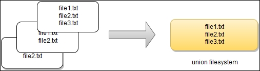
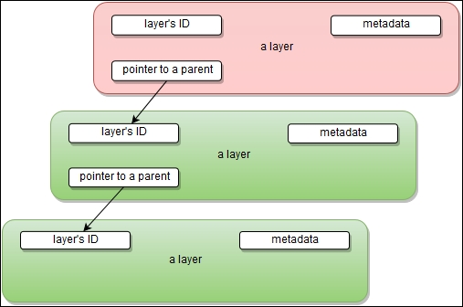
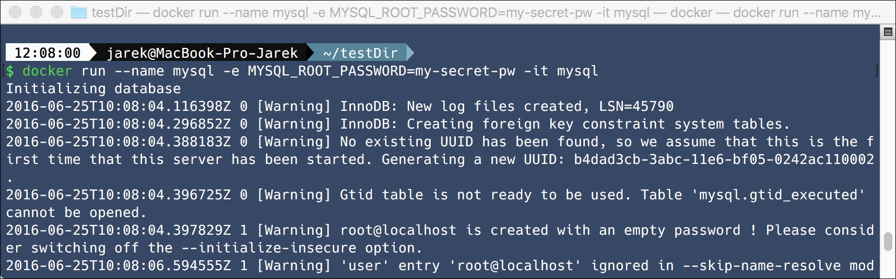

# Benefits of using Docker

## Speed and size

## Reproducible and portable builds

## Immutable and agile infrastructure

## Docker Engine and Docker Engine client

Docker is a client-server application. It consists of the daemon that does the important job: builds and downloads images, starts and stops containers and so on. It exposes a REST API that specifies interfaces for interacting with the daemon and is being used for remote management. Docker Engine accepts Docker commands from the command line, such as docker to run the image, docker ps to list running containers, docker images to list images, and so on.

The Docker client is a command-line program that is used to manage Docker hosts running Linux containers. It communicates with the Docker server using the REST API wrapper. You will interact with Docker by using the client to send commands to the server.

Docker Engine works only on Linux. If you want run Docker on Windows or Mac OS, or want to provision multiple Docker hosts on a network or in the cloud, you will need **Docker Machine**.

## Docker Machine

It's a quick way to get a new virtual machine provisioned and ready to run Docker containers. Docker Machine not only creates a new VM with the Docker Engine installed in it, but sets up the certificate files for authentication and then configures the Docker client to talk to it. In fact, when you install Docker for Windows or Mac OS, the default VirtualBox driver will be used. The following command will be executed behind the scenes:

```bash
docker-machine create --driver=virtualbox default
```
Another available driver is amazonec2 for Amazon Web Services. It can be used to install Docker on the Amazon's cloud

The list contains the following drivers at the moment:

Amazon Web Services
Microsoft Azure
Digital Ocean
Exoscale
Google Compute Engine
Generic
Microsoft Hyper-V
OpenStack
Rackspace
IBM Softlayer
Oracle VirtualBox
VMware vCloud Air
VMware Fusion
VMware vSphere

 If you want to deal with the cloud providers or just want to have common runtime environment portable between Mac OS, Windows, and Linux, you can install Docker Machine for Linux as well. 

 # Chapter 3. Understanding Images and Containers

 ## Layers
 Each image consists of a series of layers that are stacked on one another. 
 
To maintain the order of layers, Docker utilizes the concept of layer IDs and pointers. Each layer contains the ID and a pointer to its parent layer. A layer without a pointer referencing the parent is the first layer in the stack, a base. You can see the relation in the following diagram:
 

 Another advantage of using layers is the persistence of history. Layers can provide a history of how a specific image was built. Once all the layers are finished downloading, you can list the layers in the specific image using the history command:

 ```
docker history ubuntu
 ```

 You can also see the graphical representation of the image using the ImageLayers web application available at https://imagelayers.iron.io

 If you create a large file in the container, make a commit (we will get to that in a while), then delete the file, and do another commit, this file will still be present in the layer history. 
 
 To flatten the image, you can export it to a TAR file, using the export command:
 ```
docker export <CONTAINER ID> >
   /home/docker/myImage.tar
 ```

 The exported file can then be imported back, using the import command:

 ```
$ 
cat /home/docker/myImage.tar | docker

   import - some-name:latest
 ```

If the free disk space is really an issue, you can pipe the output stream of export into the input stream of import:
```
$ docker export <CONTAINER ID> | docker
   import - exampleimagelocal:new
```

Alternatively, you can use the docker-squash utility, available at GitHub https://github.com/jwilder/docker-squash, to make your images smaller. It will squash multiple Docker layers into one in order to create an image with fewer and smaller layers.

As we have said before, Docker images are stored as series of read-only layers. This means that once the container image has been created, it does not change. But having all the filesystem read-only would not have a lot of sense. What about modifying an image? Adding your software to a base web server image? Well, when we start a container, Docker actually takes the read-only image (with all its read-only layers) and adds a read/write layer on top of the layer's stack. Let's focus on containers now.

## Containers

A running instance of an image is called a **container**. Docker launches them using the Docker images as read-only templates. To use a programming metaphor, if an image is a class, then a container is an instance of a class-a runtime object. Containers are lightweight and portable encapsulations of an environment in which to run applications. 

```
$
docker run -it ubuntu:latest
   /bin/bash
```

Sometimes we can tell Docker that we will not need a container after it is stopped. For this purpose, there is the -rm option available for the run command:
```
docker run -i -t -rm ubuntu:latest
   /bin/bash
```

To stop a container, use the docker stop command. The Docker stop has the following syntax:

```
docker stop [OPTIONS] <container
    ID/name> [<container ID/name...]

 docker stop fa19b25b311e

 docker stop $(docker ps -q)   -- stop all the containers which are running.

 docker ps -a
```

To remove a container, you can just use the rm command. If you want to remove all stopped containers at once, you can use the list of containers (given by the ps command) and a filter:
```
docker rm -v $(docker ps -q -f
    status=exited)
```
### Saving changes to a container

If you modify a file in the running container, the file will be copied out of the underlying read-only layer and into the top, read/write layer. Your changes will be applied only in the top layer, and the union filesystem will hide the underlying file. The original file will not be destroyed - it still exists in the underlying, read-only layer.If you delete the container, and relaunch the same image again, Docker will start a fresh container without any of the changes made in the previously running container.

In other words, your changes to the filesystem will not affect the base image. However, you can create a new image from a running container (and all its changes) using the commit command:

```
docker commit <container-id> 
    <image-name>
```

Creating images by altering the top writable layer in the container is useful when debugging and experimenting, but it's usually better to use Dockerfile to manage your images in a documented and maintainable way. 

## Docker registry, repository and index

You can tag an image, and store multiple versions of that image with different IDs in a single named repository, access different tagged versions of an image with a special syntax, such as username/image_name:tag. A Docker repository is identified by a URI and can either be public or private.

```
{registryAddress}/{namespace}/{repositoryName}:{tag}

docker pull ubuntu:14.04 
```

To run you own docker hub

```
docker run -d -p 5000:5000 --name
   registry registry:2
```

## Summary

We already know that the Dockerfile is the source code of the Image. It contains ordered instructions on how to build an image. An image is a specific state of a filesystem: a read-only, frozen immutable snapshot of a live container. It's composed of layers representing changes in the filesystem at various points in time; layers are a bit like the commit history of a Git repository. Containers, on the other hand are runtime instances of an image. They can have state (for example, running or stopped). You can make changes to the filesystem on a container and commit them to make them persisted, but only changes in the filesystem can be committed - memory changes will be lost. Commit always creates a new image. We also mentioned the concept of a registry, which holds a collection of named repositories, which themselves are a collection of images tracked by their IDs. A registry is like a Git repository: you can push and pull containers. 

# Chapter 4. Networking and Persistent Storage

## Docker networking
Docker uses the concept of the Container Network Model (CNM). 

There are three entities present in the CNM:

* sandbox: This is an isolated environment holding the networking configuration for a container.
* endpoint: This is a network interface that can be used for communication over a specific network. Endpoints join to exactly one network. Multiple endpoints can exist within a single network sandbox.
* network: It's a group of endpoints that are able to communicate with each other. You could create, for example, two separate networks, and they will be completely isolated. Network can be identified by their names (such as backend and frontend) or IDs (generated automatically by Docker during the network creation).


By default, two network drivers are provided by Docker: the bridge and the overlay driver. 

All containers on the same network can communicate with each other *freely*. An endpoint provides network connectivity for a sandbox - if you need to join a container to multiple networks, there should be multiple endpoints per container. 

### Default networks

We have three networks installed by default: host, none, and bridge.

### Host network

If you start your container with the --net=host option, then the container will use the host network. It's a network created by default and it is using the host driver. It's as fast as the normal networking: there is no bridge, no translation, nothing. That's why it can be useful when you need to get the best network performance. In this mode, container shares the networking namespace of the host (your local machine, for example), directly exposing it to the outside world. In the case of --net=host, the container can be accessed through the host's IP address. **This also means that you need not use port mapping to reach services inside the container**. However, you need to be aware that this can be dangerous. If you have an application running as root and it has vulnerabilities, there will be a risk of security breach - someone can get the remote control of the host network via the Docker container.

## Bridged network

It's also the default network in Docker. When the Docker service daemon starts, it configures a virtual bridge named docker0. Unless you specify a network with the docker run --net=<NETWORK> option, the Docker daemon will connect the container to the bridge network by default. Docker will find a free IP address from the range available on the bridge and will configure the container's eth0 interface with that IP address. From now on, if the new container wants to, for example, connect to the Internet, it will use the bridge - the host's own IP address will be used as the gateway. This bridge will automatically forward packets between any other network interfaces that are attached to it and also allow containers to communicate with the host machine as well as with the containers on the same host.

**By default, Docker containers can make connections to the outside world, they connect via the docker0 interface, but the outside world cannot connect to containers.**

The docker network inspect command that we saw earlier shows all the connected containers and their network resources on a given network. 

## Creating a network

```
$ docker network create backend
```

## Running a container in a network

```
docker run -it --net=bridge ubuntu

docker run -it --name=myUbuntu --net=bridge ubuntu
docker run -it --net=container:myUbuntu busybox
```

This will make your busybox container run on the same network that the Ubuntu container is running on, no matter what network it is. The containers you launch into the same network must be run on the same Docker host. Each container in the network can immediately communicate with other containers in the network.

You could run ping coomand like ping myUbuntu in busybox.
```
docker network inspect backend
```

In practice, you will probably have a lot of networks with small numbers of containers connected to them. Networks are all isolated from each other. If two containers are not on the same network, they cannot talk directly.

You may want that your containers running on separate Docker hosts to communicate over the network someday. In this case, the multi-host networking feature of Docker comes in handy.

## Exposing and mapping ports

You can expose a port in two ways, either in the Dockerfile with the EXPOSE instruction (we will do it in the chapter about creating images later) or in the run command using the --expose option. These are equivalent commands, though --expose will accept a range of ports as an argument (for example, --expose=1000-2000).

You can bind a port using -p at runtime only.

If you EXPOSE a port, the service in the container is not accessible from outside Docker, but from inside other Docker containers. So this is good for intercontainer communication.

The -p option, on the other hand, is like publish - it will create a port mapping rule, **mapping a port on the container with the port on the host system**. If no port on the host is specified, Docker will automatically allocate one. Note that if you execute -p, but do not execute EXPOSE, **Docker does an implicit EXPOSE**. This is because if a port is open to the public, it is automatically also open to other Docker containers.


EXPOSE

This signals that there is a service available on the specified port. This is used in the Dockerfile that makes exposed ports open for other containers.

--expose

This is similar to EXPOSE, but is used at runtime.

-p

This specifies a port mapping rule, mapping the port on the container with the port on the host machine. This makes a port open from outside of Docker.

-P

This map is the dynamically allocated port on the host machine to all ports exposed using EXPOSE or -expose.


```sh
docker run -p <containerPort>:<hostPort> <image ID or name>

# below are only accessible by other docker container.
docker run --expose=7000-8000 <container ID or name>

docker run --name nginx -d -p 8080:80 nginx

docker run --name nginx -d -p 8080:80 -p 8081:80 nginx
# The -p flag can be used multiple times to configure multiple ports.
```

## Linking containers

 To link containers together, we use the --link option in the run command. If we link one container to another, two things will happen under the hood. First, Docker will update the linked container's /etc/hosts file automatically to reference to the container we are linking to.

 Let's try it for the example. First, let's run the MySQL container on the bridge network:

 

 Next, let's run the second container, again the latest Ubuntu, but this time linking it with the MySQL container:

 ```sh
 docker run -it --name=ubuntu --link mysql:mysql ubuntu
```
You can notice that Docker automatically adjusted the /etc/hosts file of the Ubuntu container, inserting an entry for the MySQL instance:

 

The second important thing that will happen when creating a link, is the transfer of some exposed environment variables from the container we are linking to. 

 

Each variable is prefixed by the uppercase alias, taken from the --link command, which is MYSQL in our case. 


Within a user-defined bridge network, linking is not supported. It works only on the bridge network created by default. If you need your containers to communicate on your created bridge network, you can expose and publish container ports on containers in this network.

Docker's linking feature is a great way for source container to provide information about itself to a recipient container. In fact, this is internal to Docker and doesn't require exposing any network ports. That's a big benefit of linking: we don't need to expose the source container to the network.

## Docker volumes

### Creating a volume

1. Creating a nameless volume by simply mapping volume to host directory (by using the -v argument for the docker run command)

2. Creating a Docker container image only for data (and then using the --volumes-from for docker run command)

3. Creating a Docker named volume explicitly (using the docker volume create command)

```sh
docker run -it -v /Users/jarek/testDir/:/data ubuntu
# the option 1,nameless volumn;
```

```sh
docker run -it -v /data2 ubuntu
#This time, Docker will create volume and map it to a internal path of the Docker setup on the host machine (it will be /var/lib/docker/volumes on the Macintosh).

docker volume inspect <volumeName>

docker run -it -v ~/.bash_history:/root/.bash_history ubuntu
#Executing the preceding command will make you having the same bash history between your local machine and a started Ubuntu container. And best of all, if you exit the container, the bash history on your own local machine will contain the bash commands you have been executing inside the container.
```

You can use the -v multiple times to mount multiple data volumes.


This way if one of your containers has volumes mounted already, you can instruct Docker to use the same volumes when starting another container. Consider the following example:
```sh
docker run -it --name myUbuntu -v /data ubuntu

docker run -it --name myBusyBox --volumes-from myUbuntu busybox
```

your Ubuntu and busybox containers will share the same volume and thus, the same data. 

The common practice when working with Docker is to create data-only containers. The only purpose of data-only containers is to carry on the volume. For any other containers that you then want to connect to this data volume container, use the Docker's ---volumes-from option to grab the volume from this container and apply them to the current container. Let's consider the following example:

```sh
$ docker create -v ~/docker-nginx/html:/usr/share/nginx/html --name
    myWebSiteData nginx

```

By executing the preceding command, we are creating a container with the name myWebSiteData. Its only purpose will be to have a /usr/share/nginx/html volume attached and mapped to ~/docker-nginx/html in your home directory. You may ask what image should you pick as a base for the data-only container. Well, it doesn't matter that much - we are not going to run this container anyway, so it will not be wasting resources such as CPU or RAM. You may use the same image for the data container as for the container with the application you are going to run. You don't leave data containers running, so it won't consume resources. 

With our data-only container ready, we can use it to provide a volume for another container (with our application, for example), using the --volumes-from option for the docker run command, just like we did previously, when dealing with nameless volumes.

Let's say we want to run nginx with the volume referenced in our data-only myWebsiteData container:

```sh
$ docker run --name docker-nginx -p 80:80 -d --volumes-from
    myWebsiteData nginx
```

Of course, the data-only container can be shared among other containers - in our case, you can run as many nginx containers as you like - as long as you enter the same --volumes-from option, they will share the same data.

### docker volume create command

```sh
docker volume create --name data

docker run -it -v data:/data ubuntu
docker run -it -v data:/sharedWeb nginx
#Volumes can be shared between containers - just run them with mapping the same volume.
docker rm -v <containerName>
docker volume rm $(docker volume ls -qf dangling=true)
```

Volumes allow sharing data between the host filesystem and the Docker container, or between other Docker containers, and they persist even if the container itself is deleted. We can use the volume drivers to further extend the file exchange possibilities.

# Chapter 5. Finding Images

 Docker registry is a service that is storing your Docker Images, and repository is a collection of different docker images with the same name, which have different tags.

 Docker Hub is available at https://hub.docker.com/.

 Useful command.

 ```sh
docker login --username myUser --password 123
docker logout


```

There can also be images with no namespace prefix-these will be images from the so-called official repositories. The official repositories are certified repositories from vendors and contributors to Docker such as Red Hat, Oracle, and Canonical. And of course, you can use them to build your own applications and services. An example of the official images can be the most-starred ubuntu, nginx, or the official version of hello-world-images that we have been using in the previous chapters.

The latest tag assigned to an image simply means that it's the image that was last built and executed without a specific tag provided. **It's easy to understand that it may be confusing-pulling the image tagged latest will not fetch the latest version of the software.**

If you pull the image without specifying a tag, Docker will download the image tagged latest. But this will not be necessary with the latest and greatest version of the software you wanted to run. Instead, you should always consult the other tags present in the repository to pick the version of software you need.

Also, the same latest tag behavior will apply if we build our own images later in this book. If you do not specify a tag after the repository name, it will be automatically assigned the latest tag in the repository.

# Chapter 6. Creating Images

## Dockerfile instructions

* FROM
```dockerfile
FROM <image>
FROM <image>:<tag>
```

* MAINTAINER
```dockerfile
MAINTAINER authors_name
```
* ADD

The ADD basically copies the files from the source on the host into the Docker image's own filesystem at the desired destination.

```dockerfile
ADD <source path or URL> <destination path >
ADD myFiles* /myDirectory/:         This will add all the files starting with myFiles
ADD file?.txt /myDirectory/:        This will replace with any single character so that it will match file1.txt, fileB.txt, and so on.

ADD config.json projectRoot/     will add the config.json file to <WORKDIR>/projectRoot/

ADD config.json /absoluteDirectory/     will add the config.json file to the /absoluteDirectory/
```

A trailing slash / is quite important when adding files or directories to an image. If the source path doesn't end with a trailing slash, it will be considered as a single file and just copied into the destination. If the source path ends with a trailing slash, it will be considered as a directory; all of its contents will then be copied into the destination path, but the directory itself will not be created at the destination path.

If the source path points to the compressed archive in one of the common formats such as zip, tar, and so on, it will be decompressed into the destination path. Docker doesn't recognize an archive by the filename, it checks the contents of the file.

The same trailing slash rules apply to the destination path: if it ends with a trailing slash, it means that it's a directory. Otherwise, it will be considered as a single file. This gives you great flexibility when constructing filesystem contents of your image--you can add files into directories or just add whole directories.

Note that when using ADD with more than one source file, the destination must be a directory and end with a slash /.

* Copy

For files and directories that do not require the ADD feature of archive unpacking or fetching from the URL, you should always use COPY.

COPY supports only the basic copying of local files into the container. On the other hand, ADD features some more, such as archive extraction, downloading files through URL, and so on. Docker's best practices say, that you should prefer COPY if you do not need those additional features of ADD. 

```dockerfile
COPY <source path or URL> <destination path >
```

* CMD

The purpose of a CMD instruction is to provide defaults for an executing container. You can think about the CMD instruction as the starting point of your image, when the container is being run later on. This can be an executable, or if you specify the ENTRYPOINT instruction .

1. CMD ["executable","parameter1","parameter2"]: This is the so-called exec form. It's also the preferred and recommended form. The important note is that the exec form does not invoke a command shell when the container is run. It just runs the executable provided as the first parameter.

2. CMD command parameter1 parameter2, This a shell form of the instruction. This means that the executable will not be the container's PID 1--and will not receive Unix signals--so your executable will not receive a SIGTERM from docker stop <container>. There is another drawback--you will need a shell in your container. If you're building a minimal image, it doesn't need to contain a shell binary. The CMD instruction using the shell form will simply fail.

When Docker is executing the command, it doesn't check if the shell is available inside the container; if there is no /bin/sh in the image, the container will fail to start. If we use the exec format, we can't use echo command, because it is a shell command.

Because CMD is like a starting point for the Docker Engine when running a container, there can only be one single CMD instruction in a Dockerfile.

If there are more than one CMD instructions in a Dockerfile, only the last one will take effect.

The parameters for the CMD command can be overridden when starting the image--if you specify arguments to docker run. 

* ENTRYPOINT

The ENTRYPOINT instruction specifies a command that will always be executed when the container starts. The CMD instruction, on the other hand specifies the arguments that will be fed to the ENTRYPOINT instruction. 

1. ENTRYPOINT ["executable", "parameter1", "parameter2"]

```dockerfile
 ENTRYPOINT [ "sh", "-c", "echo $HOSTNAME" ]
```
Variables that are defined in the Dockerfile using ENV

2. ENTRYPOINT command parameter1 parameter2

```dockerfile
FROM busybox
ENTRYPOINT ["/bin/ping"]
CMD ["localhost"]
```

If you now run the container built from this Dockerfile, the ping command, as an image ENTRYPOINT will be processing arguments from the supplied CMD argument: localhost, in our case. As a result, you will have a /bin/ping localhost command-line response:

 

 The ENTRYPOINT command and parameters will not be overwritten from the command line. Instead, all the command-line arguments will be added after ENTRYPOINT parameters.

 You can use the exec form of ENTRYPOINT to set fairly stable default commands and arguments and then use either form of CMD to set additional defaults that are more likely to be changed.

 As you can see, both CMD and ENTRYPOINT instructions define what command gets executed when running a container. Let's summarize what we have learnt about the differences and their co-operation:

1. Dockerfile should specify at least one of the CMD or ENTRYPOINT instructions
2. Only the last CMD and ENTRYPOINT in a Dockerfile will be used
ENTRYPOINT should be defined when using the container as an executable
3. You should use the CMD instruction as a way of defining default arguments for the command defined as ENTRYPOINT or for executing an ad-hoc command in a container
4. CMD will be overridden when running the container with alternative arguments
5. The ENTRYPOINT argument sets the concrete default application that is used every time a container is created using the image
6. If you couple ENTRYPOINT with CMD, you can remove an executable from CMD and just leave its arguments, which will be passed to the ENTRYPOINT instruction
7. The best use for the ENTRYPOINT instruction is to set the image's main command, allowing that image to be run as though it was that command (and then use CMD as the default flags).

* LABEL

```dockerfile
LABEL "key"="value"
LABEL description="This is my \ multiline description of the software."

```

* ENV 

The first form, ENV <key> <value> will set a single variable to a value.

The second form is ENV <key>=<value> ..., and allows setting multiple environment variables at once. 

Note that you can use ENV to update the PATH environment variable, and then CMD parameters will be aware of that setting. This will result in a cleaner form of CMD parameters in the Dockerfile. Consider the following example:

```dockerfile
ENV CONFIG_TYPE=file CONFIG_LOCATION="home/Jarek/my \ app/config"
ENV PATH /var/lib/tomcat8/bin:$PATH 

ENV TOMCAT_VERSION_MAJOR 8
ENV TOMCAT_VERSION 8.5.4
RUN curl -SL http://apache.uib.no/tomcat/tomcat-$TOMCAT_VERSION_MAJOR/v$TOMCAT_VERSION/bin/apache-tomcat-$TOMCAT_VERSION.tar.gz | tar zxvf apache-tomcat-$TOMCAT_VERSION.tar.gz  -c /usr/Jarek/apache-tomcat-$TOMCAT_VERSION
ENV PATH /usr/Jarek/apache-tomcat-$TOMCAT_VERSION/bin:$PATH
```
Setting this will ensure that CMD ["startup.sh"] works, because it will find the startup.sh file in the system PATH. You can also use ENV to set the often modified version numbers so that upgrades are easier to handle.

The ENV values can be also overridden just before the start of the container, using docker run --env <key>=<value>.

* EXPOSE

The EXPOSE instruction informs Docker that the container listens on the specified network ports at runtime. 

We already know that EXPOSE does not make the ports of the container automatically accessible to the host. To do that, you must use either the -p flag to publish a range of ports or the -P flag to publish all of the exposed ports at once.

```dockerfile
docker run nginx -p 80
docker run nginx -P
```

* RUN

The RUN instruction is the central executing instruction for Dockerfiles. In essence, the RUN instruction will execute any commands in a new layer on top of the current image and then commit the results. The resulting committed image will be used as a base for the next instruction in the Dockerfile. 

The command supplied through the RUN instruction is executed during the build time, whereas the command specified through the CMD instruction is executed when the container is launched by executing docker run on the newly created image. 

RUN, similarly to CMD and ENDPOINT, can take two forms:

1. RUN <command>: This is a shell form. 

2. RUN ["executable", "parameter1", "parameter2"]: This an exec form. 

If the RUN command doesn't change between two builds, Docker's cache will not get invalidated. In effect, Docker will reuse the previous results from cache. This is clearly harmful, when, for example, the RUN command is a source code checkout, for example, a Git clone as the first step of a project's build.

That's why it's good to know how to selectively invalidate the cache. In the Docker world, this is called cache busting.

```dockerfile
FROM ubuntu
RUN apt-get update
RUN apt-get install -y mongodb-server
```

If we build an image from this Dockerfile, all layers from two RUN instructions will be put into the layers cache. But, after a while you decide you want the node.js package in your image, so now the Dockerfile looks like this:

```dockerfile
FROM ubuntu
RUN apt-get update
RUN apt-get install -y mongodb-server
RUN apt-get install -y nodejs
```

On the second build, Docker will reuse the layers by taking them from the layer's cache. As a result the apt-get update will not be executed, because the cached version will be used. In effect, your newly created image will potentially have an outdated version of the MongoDb and node-js packages. You should always have the cache concept in mind when creating RUN instructions. 


We should always combine RUN apt-get update with apt-get install in the same RUN statement, which will create just a single layer. Consider the following example:

```dockerfile
RUN apt-get update \
&& apt-get install -y mongodb-server \
&& apt-get install -y nodejs
```

Yet better than this, you can also use a technique called version pinning to avoid cache problems.

```dockerfile
RUN apt-get update \
&& apt-get install -y mongodb-server \
&& APT-GET INSTALL -Y NODEJS= 0.6.12~DFSG1-1UBUNTU1
```

Using apt-get update alone in a RUN statement is not recommended because of the caching issues.

The cache for RUN instructions can be invalidated by ADD instructions or using the --no-cache flag, for example:

```dockerfile
docker build --no-cache
```

* USER

* VOLUME

The syntax couldn't be simpler, it's just VOLUME ["/volumeName"].

The parameter for VOLUME can be a JSON array, a plain string with one or more arguments, for example:

```dockerfile
VOLUME ["/var/lib/tomcat8/webapps/"]
VOLUME /var/log/mongodb /var/log/tomcat
```

The VOLUME instruction creates a mount point with the specified name and marks it as holding externally mounted volumes from native host or other containers.

Basically, the VOLUME and -v options are almost equal. A difference between the VOLUME and -v options is that you can use the -v option dynamically and mount your host directory on your container when starting it by executing docker run. 

The fundamental difference between VOLUME and -v is this: -v will mount the existing files from your operating system inside your Docker container and VOLUME  will create a new, empty volume on your host and mount it inside your container.

* WORKDIR

* ARG

If you need to pass an argument at build time to the Docker during the docker build command, you can use the ARG instruction in the Dockerfile. 

Later on, during the build, any value can be passed to the docker build command using the --build-arg switch:

```sh
--build-arg <variable name>=<value>
```

```dockerfile
FROM ubuntu
ARG user
ARG version

FROM ubuntu
ARG user=jarek
```

```sh
docker build --build-arg user=somebodyElse .
```

* STOPSIGNAL

# Chapter 7.  Running Containers

When you execute the docker run command, the container process that runs is isolated and has its very own filesystem, networking stack, and isolated process tree separate from the host. You run the image using the docker run command. Keep in mind that every docker run creates a new container with the specified image and starts a command inside it (CMD or ENTRYPOINT specified in the Dockerfile). By default, the file system of a container is persistent, even after the container shut down. These file systems can grow in size very quickly if you run short-term foreground processes again and again. The solution is that instead of cleaning it manually by hand, tell Docker to automatically clean up the container and remove the file system when the container exits. You can do this by adding the **-rm** flag, so that the container data is removed automatically after the process is finished.

```sh
docker run --rm -it Ubuntu /bin/bash

```

## Detached

Take note of the fact that the containers started in detached mode exit when the root process used to run the container exits. Understanding this is important even if you have some process running in the background (started from the instruction in the Dockerfile). Docker will stop the container if the command that started the container finishes. In other words, Docker requires your command to keep running in the foreground; otherwise, it thinks that your application stops and shuts down the container. For example, if the default command in your container is bash, when you run the image in background using the -d command line option, the shell will exit immediately and Docker will stop the container.

But there is a solution for this. You can cheat Docker by executing a foreground command forever.

```sh
docker run -d myImage tail -f /dev/null
```

Executing the tail command on /dev/null will keep the main bash shell busy and will not allow Docker to shut the container down.

docker logs command. You can access the log files because everything that is written to stdout for the process that is pid 1 inside the container will get captured in a special history file on the Docker host. 

```sh
docker logs -f <container name>
```

To retain control over a detached container, use the dockerattach command. The syntax for docker attach is:

```sh
docker attach [OPTIONS] <container ID or name>
```

The docker attach command can come in handy if you want to see what is written to the stdout stream in real time. It will basically reattach your console to the process running in the container. In other words, it will stream the stdout into your screen and map the stdin to your keyboard, thus allowing you to enter the commands and see their output. To detach from the process, use the default Ctrl + P, Ctrl + Q keyboard sequence.

## Foreground

The foreground mode is the default one. It's the opposite of the detached mode and it's used when you simply do not specify the -d option. 

```sh
docker run -a stdin -a stdout -i -t centos /bin/bash
```

The preceding command will attach both stdin and stdout streams to your console.

There are -i or  --interactive (for keeping the STDIN stream open even if not attached) and -t or --tty (for attaching a pseudo-tty) switches, commonly used together as -it, which you will need to allocate a pseudo-tty console for the process running in the container. It is used to attach the command line to the container after it has started. 

```sh
docker run -it ubuntu
```

## Identifying images and containers

Docker will pick the image tagged by latest by default. You can also use the tag syntax or the digest syntax:

```sh
Image[:tag]
Image[@digest]

docker run ubuntu:14.04
docker -it run ubuntu@sha256:1ffcb21397aa4012a9d88cff8582224ff06aa13ba2de2e9f96c9814bfda95e0 /bin/bash
```

To limit the number of active processes within the container, execute the docker run command with --pids-limit value set:

```sh
docker run --pids-limit=64
```

## Overriding default commands from Dockerfile

* Overriding the CMD and ENTRYPOINT

Anything that appears after the image name in the docker run command is passed to the container and treated as CMD arguments. As a result, if the image also specifies an ENTRYPOINT then the CMD or COMMAND gets appended as arguments to the ENTRYPOINT. 


```sh
docker run [OPTIONS] IMAGE[:TAG|@DIGEST] [COMMAND] [ARG...]

docker run -it --entrypoint /bin/bash Ubuntu

dockerexec
```

## Executing arbitrary commands with exec

In opposite of the overriding the CMD or ENTRYPOINT, the command started using docker exec will only run while the container's primary process (PID 1) is running.

```sh
docker run -it ubuntu bash --name myUbuntuBash
docker exec -d myUbuntuBash touch /tmp/myFile
```

## Monitoring containers

### Log

```sh
docker logs -f <container name>

docker inspect -f {{.LogPath}} 351c05e5ca22

docker run --log-driver=syslog ubuntu
```
The -f flag acts as the same flag in Linux tail command; it will continuously display new log entries on the console. 

The docker logs command is available only for the json-file and journal logging drivers. To access logs written to other log engines, you will need to use the tools provided by the vendor of the log solution, such as Splunk.

### Container events

To get the real-time events from the server, we use the docker events command.
When something has changed during the container runtime, such as stop, pause or kill container will store and publish an event for that case. 

### Inspecting a container

```sh
docker inspect [OPTIONS] CONTAINER|IMAGE|TASK [CONTAINER|IMAGE|TASK...]

docker inspect -f '{{if ne 0.0 .State.ExitCode }}{{.Name}} {{.State.ExitCode}}{{ end }}' $(dockerps -aq)
```

Note that we provide $(dockerps -aq) instead of container ID or name. As a result, all of the running containers IDs will be piped to the docker inspect command, which can be a very handy shortcut. The curly brackets {{}}means that the Go template directives anything outside of them will be printed out literally. The dot (.) in Go templates means context. Most of the time, the current context will be the complete data structure for the metadata, but it can be rebound when needed, including using the with action. For example, the following two inspect commands will print out exactly the same result:

```sh
docker inspect -f '{{.State.ExitCode}}'wildfly
docker inspect -f '{{with .State}} {{.ExitCode}} {{end}}'wildfly
```

### Container exit codes and restart policies

When the dockerrun command ends with a non-zero code, the exit codes follow the chroot standard, as you can see in the following example:

1. exit code 125:The docker run command fails by itself
2. exit code 126: The supplied command cannot be invoked
3. exit code 127: The supplied command cannot be found
4. Other, non-zero, application dependent exit code.


Currently Docker has four restart policies.

**No**

**Always**. If we want the container to be restarted no matter what exit code the command would have, we can use the always restart policy. The restart policy will always restart the container. This is true even if the container has been stopped before the reboot. Whenever the Docker service is restarted, containers using the always policy will also be restarted, it doesn't matter whether they were executing or not.

**on-failure**
This is a special restart policy and probably the most often used one. Using the on-failure restart policy, you can instruct Docker to restart your container whenever it exits with a non-zero exit status and not restart otherwise.

```sh
dockerrun --restart=on-failure:5 mongo

docker inspect -f "{{ .RestartCount }}"<ContainerID>

docker inspect -f "{{ .State.StartedAt }}"<ContainerID>
```
You should know that Docker uses a delay between restarting the container, to prevent flood-like protection. 

In effect, the daemon will wait for 100 ms, then 200 ms, 400ms, 800ms, and so on, until either the on-failure limit is reached or when you stop the container using docker stop or execute the force removal by executing the dockerrm -f command.

**unless-stopped**
The unless-stopped restart policy acts the same as always with one exception, it will restart the container regardless of the exit status, but do not start it on daemon startup if the container has been put to a stopped state before. 

Before you apply the restart policy to your container, it's good to think what kind of work the container will be used to do. That also depends on the kind of software that will be running on the container. A database for example, should have probably always or unless-stopped policy applied. If your container has some restart policy applied, it will be shown as Restarting or Up status when you list your container using the dockerps command.


To set the policy during the runtime, we can use the docker update command. Apart from other runtime parameters (such as memory or CPU constraints for example, about which we are going to tell in a while later in this chapter), the docker update command gives you the possibility to update the restart policy on a running container. 

```sh
docker update --restart=always <CONTAINER_ID or NAME>

docker inspect --format '{{ .HostConfig.RestartPolicy.Name }}'<ContainerID>
```

You can also see what restart policy was applied using the docker events command you already know from the previous section. The docker events that can be used to observe the history of runtime events that the container has reported, will also report the docker update event, providing you the details what has changed.

## Runtime constraints on resources

### Memory
The syntax of the docker run command with memory constraints set will be as follows:

```sh
docker run -it -m 512m ubuntu

docker run -it -m 1G --memory-reservation 500M ubuntu /bin/bash

docker run -it --kernel-memory 100M ubuntu  /bin/bash

docker run -it -m 1G --kernel-memory 100M ubuntu /bin/bash
```

If you do not set a limit on the memory container can allocate can lead to random issues where a single container can easily make the whole host system unstable and/or unusable. So it's a wise decision to always use the memory constraints on the container.

When memory reservation is applied, Docker will detect low memory situation and will try to force container to restrict it's consumption up to a reservation limit. If you do not set the memory reservation limit, it will be the same as the hard memory limit set with the -m switch.

Memory reservation is not a hard limit feature. There's no guarantee the limit won't be exceeded. The memory reservation feature will attempt to ensure that memory will be allocated based on the reservation setting.

The preceding command sets the hard memory limit to one gig, and then sets the memory reservation to half a gig. With those constraints set, when the container consumes memory more than 500M and less than 1G, Docker will attempt to shrink container memory below 500M.


The kernel memory is something entirely different from the user memory--the main difference is that kernel memory can't be swapped out to disk. It includes stack pages, slab pages, sockets memory pressure, and TCP memory pressure. You use the --kernel-memory switch setup kernel memory limit to constrain these kinds of memory. 

### Processors

Using the -c (or --cpu-shares as an equivalent) for the docker run command switch it's possible to specify a value of shares of the CPU that container can allocate. By default, every new container has 1024 shares of CPU and all containers get the same part of CPU cycles. 

Consider three containers, one (let's call it Container1) has --cpu-shares set for 1024 and two others (Container2 and Container3) have a --cpu-shares setting of 512. When processes in all three containers attempt to use all of the CPU power, the Container1 would receive 50% of the total CPU time, because it has half of the CPU usage allowed in comparison to the sum of other running containers (Container2 and Container3). If we add a fourth container (Container4) with a --cpu-share of 1024, our first Container1 will only get 33% of the CPU, because it now has one third of the total CPU power assigned, relatively. Container2 will receive 16.5%, Container3 also 16.5% and the last one, Container4, again, will be allowed to use 33% of the CPU.


```sh
docker update --cpu-shares 512 -m 500M abbdef1231677 dabdff1231678
docker update --cpu-shares 512 abbdef1231677
docker update --restart=always -m 300M aabef1234716
```

## Docker Swarm mode

Running a single application in a Docker container is easy. We already did it a number of times. But what about scaling and fail-over? 

We don't have to make the decision on which host to start every container on. It will be made automatically by Swarm - in the background, Docker running in swarm mode decides which nodes to start them on. It may seem complex, but in real life running Docker Swarm is as easy as running single Docker containers. 

```sh
docker swarm init --advertise-addr<IP>

docker swarm join \
  --token
SWMTKN-1-5p7kzi2jbising1pew571s9ljidy61biticftzbwmj5j4nfocg-6aieefd3frhl3ow3zppulc0bc

docker service create --replicas 1 -p80:80 --name nginx nginx
docker service scale nginx=3
docker service ls
docker service ps
```
 


To connect a node to the Swarm, execute the docker swarm join command, including the token you were given from the docker swarm init command

# Publishing Images

```sh
docker tag IMAGE[:TAG] IMAGE[:TAG]

docker tag myHelloWorld:test myRepo/myHelloWorld:version1.0.test

docker login --username=yourUsername --email=yourEmail@address.com

docker push yourUsername/myRepo
```

Automatic Build repository is a great feature; it allows you to keep the source of your images (including of course, Dockerfiles) and the images on the DockerHub in sync. We also know how to use Webhooks feature to do some more automation, for example continuous deployment. In the next chapter, we will go a little bit more into using Docker, we will be utilizing Docker to package our Java and JavaScript application into the container.

# Using Docker in Development

## Using Docker with Maven

### Spotify's Maven Docker plugin

It's available as open source and you can get the sources and documentation from GitHub: https://github.com/spotify/docker-maven-plugin. You can use this plugin to create a Docker image with artifacts built from your Maven project.

The plugin will expect the Dockerfile in this directory, so if you specify that directory, it must contain valid Dockerfile.

```xml
<build>
      <plugins>
        <plugin>
          <groupId>com.spotify</groupId>
          <artifactId>docker-maven-plugin</artifactId>
          <version>0.4.13</version>
          <configuration>
            <imageName>myImage</imageName> <dockerDirectory>docker</dockerDirectory>
            <resources>
              <resource>
                <targetPath>/</targetPath>
                <directory>${project.build.directory}</directory>
                <include>${project.build.finalName}.jar</include>
              </resource>
            </resources>
          </configuration>
        </plugin>
      </plugins>
    </build>
```

In the preceding example we have included the plugin in the plugins section of the pom.xml file. One jar file from the ${project.build.directory}, which will be the /target directory by default will be included in the build context. This time it will be a jar file named as your application name, containing your built application.

```sh
mvn clean package docker:build

mvn clean package docker:build -DpushImage
```

### fabric8io Maven Docker plugin

Fabrio8.io Docker Maven plugin is very powerful and flexible when it comes to the configuration. To setup the image configuration, you will need to create <image> element in the <configuration><images> element, as shown on the following example:

```xml
<configuration>
      <images>
        <image>
          <alias>myApplication</alias>
          <name>me/my-application:${project.version}</name>
          <build>
            <from>java:8</from>
            <assembly>
              <descriptor>artifact</descriptor>
            </assembly>
            <cmd>
              <shell>java -jar maven/myApplication.jar</shell>
            </cmd>
          </build>
          <run>
            <ports>
              <port>8080:8080</port>
            </ports>
          </run>
        </image>
      </images>
    </configuration>
```

If you want to use the existing Dockerfile, you need to provide additional dockerFileDir and dockerFile elements. The first one will specify a directory containing a Dockerfile, the second one will point to the specific Dockerfile in that directory. All files in the directory that are specified as the dockerFileDir element will also be included in the image build context.

The inline configuration, on the other hand, will describe the image building process in the pom.xml itself. You will need to provide elements, such as <from>, which will contain the base image (as FROM instruction in the Dockerfile). The assembly descriptor contains all the files that will go into the image and <cmd> contains the command to run when a container is created. 

```xml
   <ports>
      <port>8080</port>
    </ports>

    <volumes>
      <volume>/path/to/volume</volume>
    </volumes>

   <entryPoint>
      <exec>
        <arg>java</arg>
        <arg>-jar</arg>
        <arg>/maven/myApplication.jar</arg>
      </exec>
    </entryPoint>
```

The fabric8.io plugin has a lot to offer when working with Maven and Docker. You can always refer to the newest documentation present on the plugin's website at https://dmp.fabric8.io/. It's the first class choice if you need to build or run Docker containers from your Maven build.

## Spring Boot application in Docker container
The basic steps for creating Java application in the container are:

* Using a base image pulled out from the Docker Hub
* Installing the application itself, it will be an executable jar file in our case
* Exposing ports, if your application needs to communicate with the outside world using a network
* Running the container

Let's begin with creating our Maven pom.xml build file, as shown in the following example:

```xml
<?xml version="1.0" encoding="UTF-8"?>
    <project>
      <modelVersion>4.0.0</modelVersion>
      <groupId>pl.finsys</groupId>
      <artifactId>hello-docker</artifactId>
      <version>0.0.1-SNAPSHOT</version>
      <parent>
        <groupId>org.springframework.boot</groupId>
        <artifactId>spring-boot-starter-parent</artifactId>
        <version>1.4.1.RELEASE</version>
      </parent>
      <dependencies>
        <dependency>
          <groupId>org.springframework.boot</groupId>
          <artifactId>spring-boot-starter-web</artifactId>
        </dependency>
      </dependencies>
      <properties>
        <java.version>1.8</java.version>
      </properties>
      <build>
        <plugins>
          <plugin>
            <groupId>org.springframework.boot</groupId>
            <artifactId>spring-boot-maven-plugin</artifactId>
          </plugin>
        </plugins>
      </build>
    </project>
```

```java
    package helloDocker;
    
    import org.springframework.web.bind.annotation.RestController;
    import org.springframework.web.bind.annotation.RequestMapping;
    
    @RestController
    public class HelloController {
        @RequestMapping("/")
        public String hello() {
            return "Greetings from Spring Boot in Docker!";
        }
    }


    package helloDocker;
    
    import org.springframework.boot.SpringApplication;
    import org.springframework.boot.autoconfigure.
      SpringBootApplication;
    import org.springframework.context.ApplicationContext;
    
    @SpringBootApplication
    public class Application {
        public static void main(String[] args) {
            ApplicationContext ctx =
              SpringApplication.run(Application.class, args);
        }
    }
```

We are going to pick the latest one, which is Java 8u102-jdk 

```xml
<plugin>
  <groupId>io.fabric8</groupId>
  <artifactId>docker-maven-plugin</artifactId>
  <version>0.16.8</version>
  <configuration>
    <dockerHost>http://127.0.0.1:2375</dockerHost>
    <verbose>true</verbose>
    <images>
      <image>
        <name>hello-docker</name>
        <build>
          <from>openjdk:8u102-jdk</from>
          <ports>
            <port>8080</port>
          </ports>
          <entryPoint>
            <exec>
              <args>java</args>
              <args>-jar</args>
              <args>/maven/hello-docker-
                    ${project.version}.jar</args>
            </exec>
          </entryPoint>
          <assembly>
            <descriptorRef>artifact</descriptorRef>
          </assembly>
        </build>
      </image>
    </images>
  </configuration>
</plugin>
```

```sh
mvn clean package docker:build
docker images
docker run -it -p8080:8080 hello-docker
```

 
  

Alternatively, to running docker run by hand, we can include the runtime section into our project's pom.xml file. The whole <image> element will look similar to this:

```xml
<image>
  <name>hello-docker</name>
  <build>
    <from>openjdk:8u102-jdk</from>
    <ports>
      <port>8080</port>
    </ports>
    <entryPoint>
      <exec>
        <args>java</args>
        <args>-jar</args>
        <args>/maven/hello-docker-${project.version}.jar</args>
      </exec>
    </entryPoint>
    <assembly>
      <descriptorRef>artifact</descriptorRef>
    </assembly>
  </build>
  <run>
    <ports>
      <port>8080:8080</port>
    </ports>
  </run>
</image>
```

```sh
mvn clean package docker:build docker:run
```

# More resource

Compose is a tool for defining and running multi-container Docker applications. With this tool you can use a single Compose file to configure your application's services. Then, using a single command, you can create and start all the services from your configuration.

Universal Control Plane is the enterprise-grade (you can install it behind your own firewall) cluster management solution from Docker. It helps you manage your whole cluster from a single interface.

Docker Trusted Registry is an enterprise-grade image storage solution from Docker--a secure place to store and manage the Docker images you use.

The Docker Store, which is the place to find the best-trusted commercial and free software distributed as Docker Images.

Apart from the official, very comprehensive documentation, there is an awesome (it's even named that way - Awesome Docker) list of Docker resources available on GitHub https://github.com/veggiemonk/awesome-docker.

The list of resources has a good structure and begins with the basics like tutorials explaining what Docker actually is and how to install it on various platforms. 